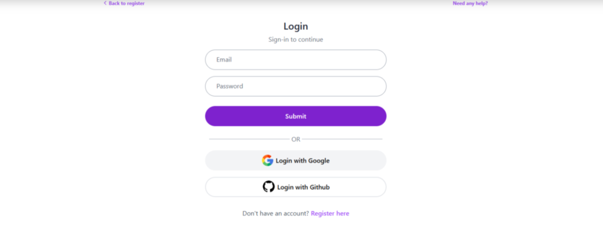
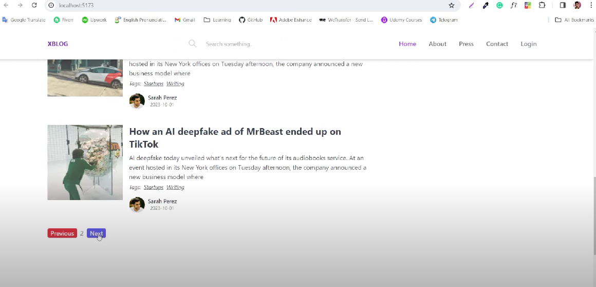
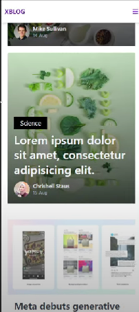
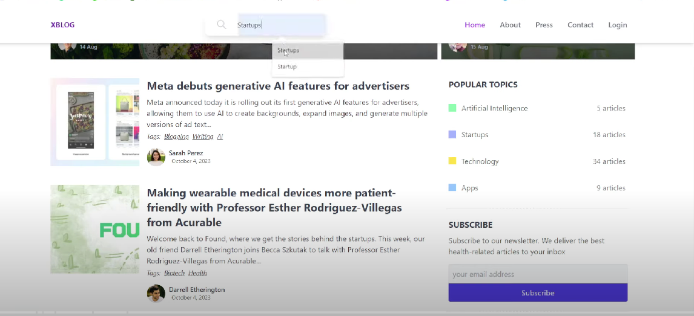
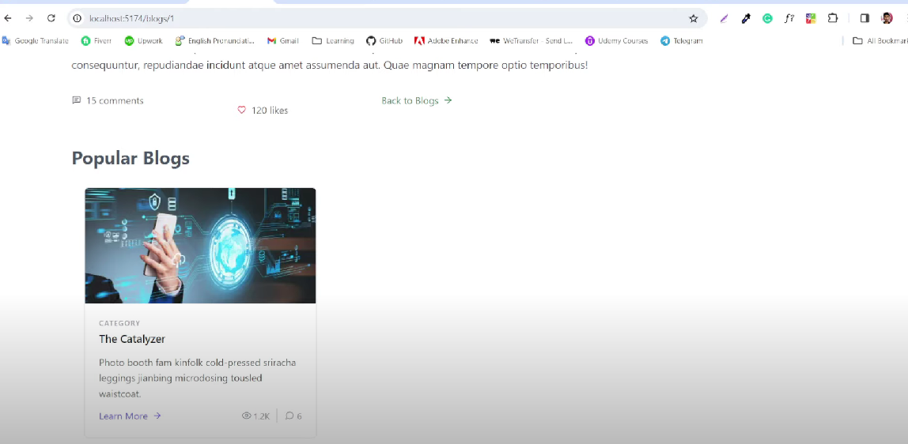

# Blog Website - Ur_Storiex XBlog

Welcome to **Ur Storiex XBlog**, a modern blog website where users can create, view, and manage blogs with ease. The platform offers features such as authentication, responsiveness, and interactive blog management. It’s built using React, Redux Toolkit, and a mock server with a `db.json` file for data storage.

## Features

- **Authentication**: 
  - Users can register and log in securely.
  - User authentication is handled via JWT (JSON Web Tokens).
  
- **Responsiveness**:
  - The website is fully responsive and works seamlessly across all devices, from desktop to mobile.

- **Create Your Blog**:
  - Users can create their own blogs and share their thoughts with others.
  
- **View Others’ Blogs**:
  - Users can explore and read blogs created by other members of the community.

- **Delete Your Blog**:
  - Users can delete their own blogs if needed.
  
- **Trending Topics**:
  - Check out the trending topics on the platform and explore the most discussed subjects.

- **Navigation**:
  - Move to the next page to view more blogs from other users.


## Screenshots

### Login Page


### Next Page


### Responsiveness


### Searching


### Trending Popular Blog



## Tech Stack

- **Frontend**:
  - React
  - Redux Toolkit
  - HTML, CSS (Styled Components for styling)
  - React Router (for navigation)

- **Backend**:
  - JSON Server (for mock backend)
  - db.json (stores blog data)

## Getting Started

Follow the steps below to set up the project locally:

### Prerequisites

- Node.js and npm installed on your system.


### Installation

1. Clone the repository:
   ```bash
   git clone https://github.com/kaushlesh79/ur_storiex_xblog.git
2. Navigate into the client directory:
   ```bash
     cd ur_storiex_xblog/client
3.Install dependencies for the frontend:
  ```bash
     npm install
 ```
4.Navigate into the server directory:
 ```bash 
     cd ../server
  ```
5.Install JSON Server:
  ```bash
   npm install json-server
  ```
6.Start the JSON Server:
   ```bash
    npx json-server --watch db.json --port 5000
   ```
7.Now, go back to the client directory and start the React frontend:
  ```bash
    cd ../client
    npm start
  ```
## Usage
    - Sign Up / Log In: Use the authentication system to create an account and log in.
    - Create Blog: After logging in, click on "Create Blog" to start writing your blog.
    -View Blogs: Explore blogs created by others from the homepage or navigate to the next page for more.
    -Trending Topics: Check the trending topics section to see what's hot.
    -Delete Blog: Users can delete their own blogs from the profile page.
## Contributing
     Feel free to fork this project, create pull requests, and contribute to the development of Ur Storiex XBlog.

## Made with ❤️ by Kaushlesh
   


  

   
